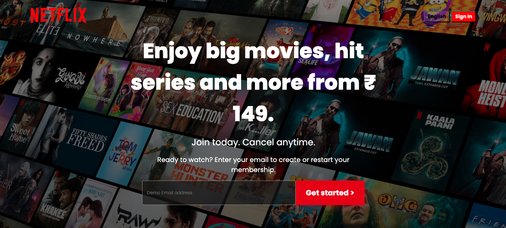
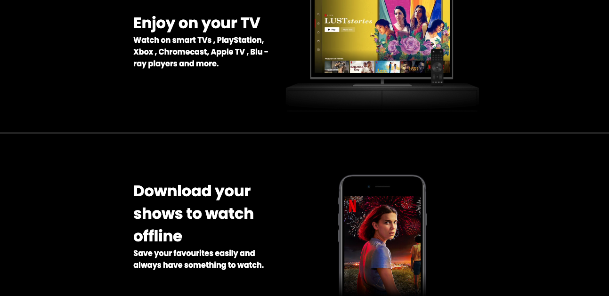
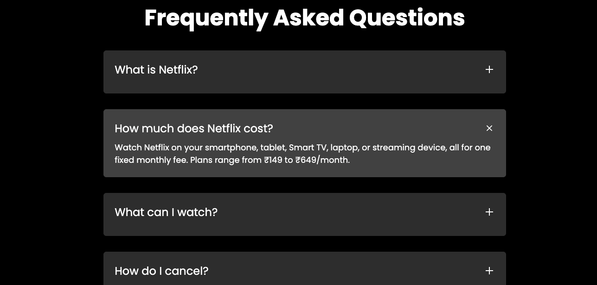

# 🎬 Netflix Clone (Frontend)


<p align="center">
  A responsive streaming platform UI inspired by Netflix, focused on production-level layout and interaction patterns.
</p>

<p align="center">
  <a href="https://stream-ui.netlify.app/"><strong>🌐 Live Demo</strong></a>
</p>

> ⚠️ If the site shows a browser security warning, try opening in incognito — this is due to temporary domain trust issues.

---

## 📸 Preview

<p align="center">
  
</p>

<p align="center">
  
</p>

<p align="center">
  
</p>

---

## 🚀 Overview

This project is a **responsive streaming platform UI inspired by Netflix, focused on production-level layout and interaction patterns**.

The goal was not just design imitation, but to understand:

* Layout systems used in production UI
* Component structuring
* Interactive behavior (FAQ accordion)

---

## 🎯 Why This Project

This project demonstrates my ability to:

* Translate real-world product UI into code
* Build responsive layouts used in production systems
* Implement interactive UI behavior using clean JavaScript logic

---

## 🛠️ Tech Stack

<p>
  
  
  
</p>

---

## ✨ Features

* 🎯 **Responsive Design** (Mobile → Desktop)
* 🎬 **Netflix-style Hero Section**
* 📺 **Feature Sections with Media**
* ❓ **Interactive FAQ Accordion**

  * Only one item expands at a time
* 🎨 **Smooth UI Transitions & Hover Effects**

---

## ⚙️ Core Interaction Logic

The FAQ section is implemented using a controlled accordion pattern:

* Only one item remains open at a time
* State is managed via dynamic class toggling
* Efficient DOM updates using event listeners

This mimics real-world UI behavior seen in production applications.

---

## 🧠 Key Learnings

* Practical use of **Flexbox & Grid**
* Managing **DOM events and state (active class)**
* Structuring UI similar to production layouts
* Writing cleaner, more maintainable CSS

---

## 🔄 Styling Evolution

This project includes two CSS files to demonstrate the progression in layout techniques:

* **style.css** → Initial version using basic CSS without Flexbox
* **styleFlex.css** → Improved version using Flexbox for better layout, responsiveness, and alignment

This reflects my ability to:

* Refactor existing code
* Improve layout structure using modern CSS practices
* Transition from basic styling to scalable, responsive design

The current project uses **styleFlex.css** as the active stylesheet.

---

## 📂 Project Structure

```bash
/project-root
│── index.html
│── style.css
│── styleFlex.css
│── script.js
│── favicon.ico
│── assets/
│    ├── images/
│    ├── preview/
│    │    ├── HeroSection.png
│    │    ├── MainSection.png
│    │    ├── FaqSection.png
│    └── videos/
```

---

## ⚠️ Limitations

* Frontend-only (no backend)
* No authentication system
* Static content (no API integration)

---

## 🔮 Future Improvements

* 🔗 Integrate Movie API (TMDB)
* 🔐 Add Authentication (Login/Signup)
* ⚛️ Convert into React-based architecture
* ♿ Improve Accessibility (ARIA + keyboard support)

---

## 👨‍💻 Author

**Arjun Yadav**

* GitHub → https://github.com/arjunyadavtech
* LinkedIn → https://www.linkedin.com/in/arjun-yadav-b762b1240/

---

## 📌 Note

This project is built for **educational purposes only** and is not affiliated with Netflix.
